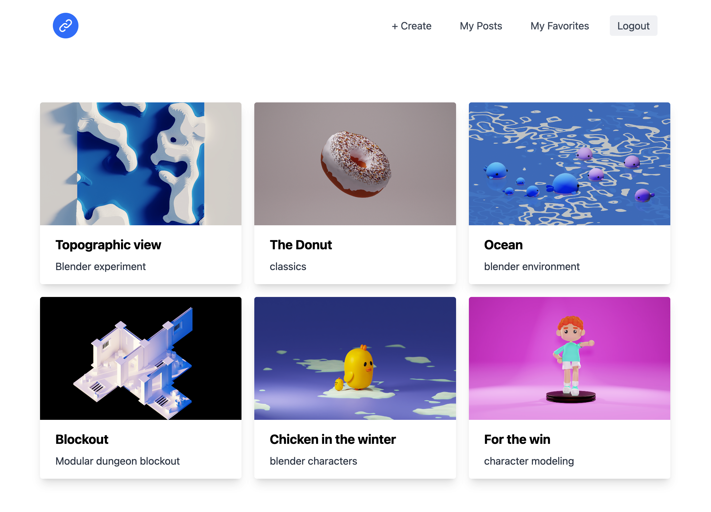

## Prisma, S3, Auth0, Graphql, Next.js project 



The complete app is running on [https://prisma-graphql-nextjs-rho.vercel.app/](https://prisma-graphql-nextjs-rho.vercel.app/) check it yourself to see the result.

This is a demo project allowing the user to sign-up/sign-up and create, view and bookmark posts.
It uses postgres for data storage, s3 for file storage, auth0 for authentication, prisma as orm, graphql as communication transport.

## Getting started

   - Create `.env` file with needed variables, checkout `.env.example` for reference.

  - Use `npx prisma db push` to sync db schema
  - Use `npx prisma db seed` to seed data (checkout `prisma/seed.ts`);

  - Auth0 is used, so custom action for login flow is needed, the action will call a hook after user is authenticated trough auth0
```
const fetch = require('node-fetch')

exports.onExecutePostLogin = async (event, api) => {
  const SECRET = event.secrets.AUTH0_HOOK_SECRET
  const URL = 'https://YOURDOMAIN/api/auth/hook'

  if (event.user.app_metadata.localUserCreated) {
    return
  }

  const email = event.user.email
  const request = await fetch(URL, { 
    method: 'post',
    body: JSON.stringify({ email, secret: SECRET }),
    headers: { 'Content-Type': 'application/json' },
  })
  const response = await request.json()
  api.user.setAppMetadata('localUserCreated', true)
}
```